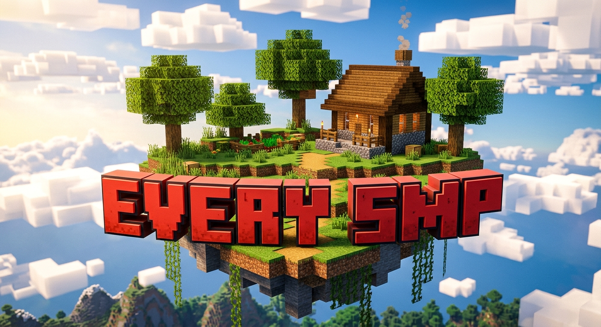
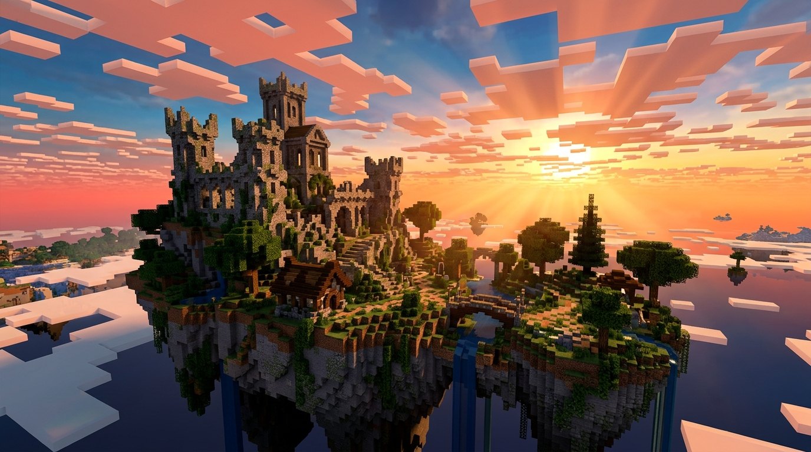

# EVERY SMP - Official Landing Page 🎮

<div align="center">
  
  
  <h3>Selamat Datang di EVERY SMP</h3>
  <p><i>Tempat Petualanganmu Menjadi Lebih Seru Dengan Berbagai Fitur Unik.</i></p>

  <p>
    <a href="https://play.everysmp.mineidhost.icu/"><strong>Kunjungi Website Resmi</strong></a> |
    <a href="https://chat.whatsapp.com/K52wGMJHVo6Hjq2cbIUOdi?mode=gi_t"><strong>Group WhatsApp</strong></a> |
    <a href="https://discord.gg/EnVQ8FZ6V6"><strong>Discord Server</strong></a>
  </p>

  
</div>

---

## 🌟 Tentang EVERY SMP

**EVERY SMP** adalah salah satu server Minecraft Survival & Economy premium terbaik di Indonesia yang mendukung lintas platform (**Java & Bedrock Edition**). Server ini dirancang secara profesional dengan ekonomi yang seimbang, sistem proteksi wilayah tingkat lanjut, komunitas yang sangat aktif, serta dukungan penuh dari jajaran staff profesional yang siap membantu Anda selama 24/7.

Website Landing Page ini dirancang secara modern, premium, cinematic, dan SEO-friendly menggunakan teknologi web modern berkinerja tinggi guna menarik minat pemain baru secara instan untuk langsung bergabung ke server kami.

---

## 🎨 Identitas Visual & Desain Website

Website ini mengadopsi standar visual modern bercita rasa fantasi-sinematik tinggi dengan tetap mempertahankan ciri khas blocky legendaris dari Minecraft:

- **Tema Desain**: Minecraft Modern, Fantasy Adventure, Glassmorphism Ringan, dan Space-Glow Efek yang Terkontrol.
- **Palet Warna**:
  - 🟥 **Primary (#F15A59)**: Warna merah logo utama yang membara.
  - 🟧 **Secondary (#FF7A6B)**: Warna oranye-coral hangat sebagai aksen pendukung.
  - ⬛ **Dark (#0F1117)** & **Background (#171A22)**: Warna dasar gelap yang memberikan nuansa misterius & sinematik.
  - 🟦 **Accent (#7BD3FF)**: Biru kosmik cerah untuk elemen interaktif istimewa.
  - 🟩 **Success (#49D17D)**: Status Online & Badge sukses.
- **Tipografi**:
  - **Heading / Judul**: Font Minecraft blocky modern yang tegas dan berani.
  - **Body / Konten**: Font modern minimalis (Inter, Plus Jakarta Sans) yang nyaman dibaca di layar mana pun.

---

## 🛠️ Fitur Utama Website

1. **Hero Section Premium**: Memadukan aset logo voxel 3D berkualitas tinggi dengan pulau melayang Minecraft sinematik sebagai latar belakang. Dilengkapi dengan animasi masuk yang halus serta scroll indicator interaktif.
2. **Server Status Widget**: Menyajikan informasi dinamis mengenai Season yang aktif, tema permainan, status koneksi (online/offline), versi game terkini, dan simulasi jumlah pemain aktif secara real-time.
3. **Penyalin IP Sekali Klik (Instant Copy)**: Mempermudah pemain Java (PC) dan Bedrock (HP/Konsol) untuk menyalin IP dan Port secara instan lengkap dengan notifikasi melayang yang cantik.
4. **Regulasi Server & Grup Terpadu**: Tata tertib lengkap di dalam server dan grup komunitas obrolan yang disajikan dengan layout kartu tabbed modern & bento grid. Dilengkapi kotak peringatan sanksi tegas bagi pelanggar aturan.
5. **Jajaran Staff Profesional**: Penayangan avatar kepala 3D Minecraft orisinil milik owner, co-owner, developer, administrator, dan helper server secara presisi dengan efek hover yang memukau.
6. **Sistem Rank & Creator**: Penawaran paket Rank premium dari tingkat ELITE hingga CUSTOM beserta syarat pendaftaran rank khusus Content Creator (YouTube & TikTok) gratis.
7. **Kontak Hubung WhatsApp & Donasi**: Tombol interaktif langsung menuju kontak Admin Utama (Refan) dan Admin Alternatif (Reza) untuk prosedur donasi cepat.
8. **Ran Dev Web Developer Watermark**: Integrasi identitas pembuat desain website premium pada bagian atas header (Banner Tipis) dan footer untuk keperluan portfolio.

---

## ⚡ Teknologi & Performa

Landing Page ini dibangun di atas arsitektur front-end berkecepatan tinggi:

*   **React 19** & **TypeScript** - Untuk manajemen state yang tangguh dan tipe data yang aman.
*   **Vite** - Bundler super cepat untuk pengembangan instan.
*   **Tailwind CSS v4** - Styling utilitas super efisien tanpa bloatware CSS.
*   **Motion (Framer Motion)** - Menghadirkan micro-interactions, floating clouds, dan transisi sehalus sutra.
*   **Lucide React** - Set ikon modern, bersih, dan beresolusi tinggi.
*   **SEO & Aksesibilitas Tingkat Tinggi**: Semantic HTML5 (`header`, `main`, `section`, `footer`), Google Schema JSON-LD terstruktur, Breadcrumb, FAQ Schema, properti `referrerPolicy="no-referrer"` untuk pemuatan aman gambar eksternal, kontras warna yang ramah mata (Lighthouse 95+), dan ramah mesin pencarian Google.

---

## 💻 Panduan Instalasi Lokal

Ingin mengunduh, mempelajari, atau menguji website ini secara lokal di komputer Anda? Ikuti panduan berikut:

### Persyaratan Sistem
*   **Node.js** versi v18 atau yang lebih baru.
*   **npm** atau **yarn** package manager.

### Langkah-Langkah

1.  **Clone Repositori**:
    ```bash
    git clone https://github.com/username/every-smp-landingpage.git
    cd every-smp-landingpage
    ```

2.  **Instal Dependensi**:
    ```bash
    npm install
    ```

3.  **Konfigurasi Environment**:
    Salin file `.env.example` menjadi `.env` dan masukkan API Key jika diperlukan:
    ```bash
    cp .env.example .env
    ```

4.  **Jalankan Server Dev**:
    ```bash
    npm run dev
    ```
    Buka peramban browser Anda di alamat `http://localhost:3000` untuk melihat pratinjau.

5.  **Build untuk Produksi**:
    ```bash
    npm run build
    ```
    Aset statis siap saji akan dikompilasi secara optimal di dalam folder `/dist`.

---

## 👨‍💻 Kontribusi

Kami sangat menyukai kontribusi komunitas! Jika Anda menemukan bug, ingin mengoptimalkan kode, atau menambahkan fitur baru:

1.  Lakukan **Fork** pada repositori ini.
2.  Buat branch baru untuk fitur Anda (`git checkout -b fitur/fitur-keren-saya`).
3.  Commit perubahan Anda dengan deskripsi yang jelas (`git commit -m 'Menambahkan fitur keren'`).
4.  Push ke branch tersebut (`git push origin fitur/fitur-keren-saya`).
5.  Ajukan sebuah **Pull Request** untuk kami tinjau secara saksama.

---

## 👨‍🎨 Hubungi Desainer Web (Ran Dev)

Website ini didesain secara profesional oleh **Ran Dev**. Jika Anda berminat untuk memesan, merancang, atau berkonsultasi mengenai pembuatan website premium, landing page bisnis, portofolio pribadi, atau sistem server custom yang responsif dan berkinerja tinggi, silakan hubungi melalui jalur resmi di bawah ini:

*   **WhatsApp**: [Hubungi Ran Dev via WhatsApp (0895-6025-92430)](https://wa.me/62895602592430?text=Halo%20Ran%20Dev,%20saya%20tertarik%20dengan%20desain%20website%20EVERY%20SMP%20dan%20ingin%20membuat%20desain%20website)
*   **Nomor Telepon**: `0895602592430`

---

## 📄 Lisensi

Proyek ini dilisensikan di bawah **Apache License 2.0**. Anda diperbolehkan menggunakan, memodifikasi, dan mendistribusikan ulang kode ini dengan menyertakan kredit pembuat asli.

---

<div align="center">
  <p><i>EVERY SMP - "Bangun, Bertahan, Berkembang Bersama." ⚔️🌲</i></p>
</div>
